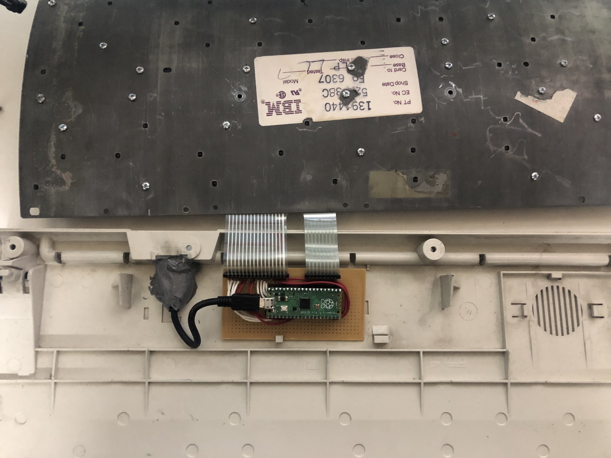
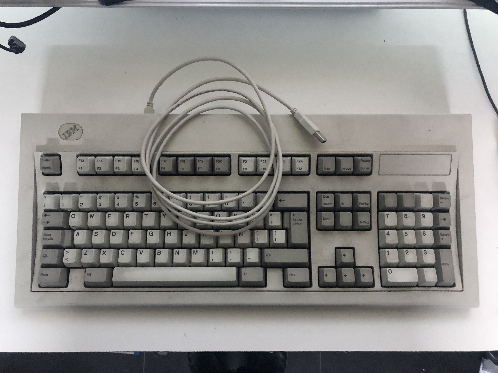

# IBM-Model-M-Pico-QMK

Este proyecto es para reciclar un teclado IBM Model M de una terminal antigua (con conector RJ45), usando una Raspberry Pi Pico con un firmware QMK.

Para empezar ir [QMK](https://docs.qmk.fm/newbs)

Con ayuda de este diagrama pude hacer la matriz.

Mapeando con esta [referencia](https://docs.qmk.fm/keycodes) de QMK.

El interior quedó así:

Y el resultado, un IBM Model M USB

